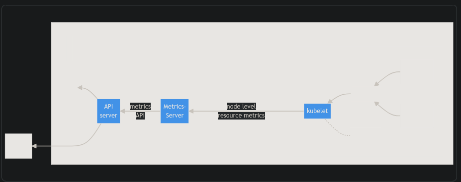

# K8s-101

Reference:

https://kubernetes.io/docs/reference/generated/kubectl/kubectl-commands

https://kubernetes.io/docs/reference/kubectl/conventions/

https://kubernetes.io/docs/reference/generated/kubectl/kubectl-commands#-strong-getting-started-strong-
To set an alias in new env
```
alias k=kubectl
```
## Pod 

- Pods are the smallest deployable units of computing that you can create and manage in Kubernetes.

- The "one-container-per-Pod" model is the most common Kubernetes use case; in this case, you can think of a Pod as a wrapper around a single container; Kubernetes manages Pods rather than managing the containers directly.

- Pod can contain init containers that run during Pod startup. You can also inject ephemeral containers for debugging a running Pod

- Pods that run multiple containers that need to work together. A Pod can encapsulate an application composed of multiple co-located containers that are tightly coupled and need to share resources. These co-located containers form a single cohesive unit.

```yaml
apiVersion: v1
kind: Pod
metadata:
  name: nginx
  labels:
    name: myapp-pod
    type: front-end
spec:
  containers:
  - name: nginx-container
    image: nginx
```

## ReplicaSet

- A ReplicaSet ensures that a specified number of pod replicas are running at any given time. However, a Deployment is a higher-level concept that manages ReplicaSets and provides declarative updates to Pods along with a lot of other useful features. Therefore, we recommend using Deployments instead of directly using ReplicaSets, unless you require custom update orchestration or don't require updates at all.

- This actually means that you may never need to manipulate ReplicaSet objects: use a Deployment instead, and define your application in the spec section


```yaml
apiVersion: apps/v1
kind: ReplicaSet
metadata:
  name: myapp-rs
  labels:
      type: front-end
spec:
  template:
    metadata:
      labels:
        type: front-end
    spec:
      containers:
        - name: nginx-container
          image: nginx
  replicas: 3
  selector:
    matchLabels:
      type: front-end              
```

- To incerese the no.of replicas you can edit the deployment file and run it or run the kctl cmd as below. But doest mean we can increase the count to 6

```bash
kubectl scale --replicas=6 replicaset myapp-rs

kubectl get rs 
kubectl delete rs myapp-rs # also delete underlying pods
kubectl replace -f myapp-ra.yaml # update the rs
```

# Deployments

- A Deployment provides declarative updates for Pods and ReplicaSets.

- You describe a desired state in a Deployment, and the Deployment Controller changes the actual state to the desired state at a controlled rate. You can define Deployments to create new ReplicaSets, or to remove existing Deployments and adopt all their resources with new Deployments.

```yaml
apiVersion: apps/v1
kind: Deployment
metadata:
  name: httpd-frontend
  labels:
      type: frontend-deploy
spec:
  template:
    metadata:
      labels:
        type: front-end
    spec:
      containers:
        - name: http-container
          image: httpd:2.4-alpine
  replicas: 3
  selector:
    matchLabels:
      type: front-end
 ```bash
kubectl create -f myapp-deploy.yaml
kubectl scale --replicas=6 replicaset myapp-rs

kubectl get deoply 
kubectl delete deploy myapp-rs # also delete underlying pods
kubectl replace -f myapp-deploy.yaml # update the rs
```

### To Create the above workload with kubectl command


Create an NGINX Pod

```
kubectl run nginx --image=nginx
```
Generate POD Manifest YAML file (-o yaml). Don't create it(--dry-run)
```
kubectl run nginx --image=nginx --dry-run=client -o yaml
```
Create a deployment
```
kubectl create deployment --image=nginx nginx
```
Generate Deployment YAML file (-o yaml). Don't create it(--dry-run)
```
kubectl create deployment --image=nginx nginx --dry-run=client -o yaml
```
Generate Deployment YAML file (-o yaml). Don’t create it(–dry-run) and save it to a file.
```
kubectl create deployment --image=nginx nginx --dry-run=client -o yaml > nginx-deployment.yaml
```
Make necessary changes to the file (for example, adding more replicas) and then create the deployment.
```
kubectl create -f nginx-deployment.yaml
```
In k8s version 1.19+, we can specify the --replicas option to create a deployment with 4 replicas.

```
kubectl create deployment --image=nginx nginx --replicas=4 --dry-run=client -o yaml > nginx-deployment.yaml

kubectl create deployment --image=busybox deployment-1 --replicas=4 -o yaml > deployment-definition-1.yaml
```


# service 

Expose an application running in your cluster behind a single outward-facing endpoint, even when the workload is split across multiple backends.

In Kubernetes, a Service is a method for exposing a network application that is running as one or more Pods in your cluster.You use a Service to make that set of Pods available on the network so that clients can interact with it.

If you use a Deployment to run your app, that Deployment can create and destroy Pods dynamically. From one moment to the next, you don't know how many of those Pods are working and healthy; you might not even know what those healthy Pods are named. Kubernetes Pods are created and destroyed to match the desired state of your cluster. Pods are ephemeral resources (you should not expect that an individual Pod is reliable and durable).

Each Pod gets its own IP address (Kubernetes expects network plugins to ensure this). For a given Deployment in your cluster, the set of Pods running in one moment in time could be different from the set of Pods running that application a moment later.

This leads to a problem: if some set of Pods (call them "backends") provides functionality to other Pods (call them "frontends") inside your cluster, how do the frontends find out and keep track of which IP address to connect to, so that the frontend can use the backend part of the workload?


## type: NodePort

For a node port Service, Kubernetes additionally allocates a port (TCP, UDP or SCTP to match the protocol of the Service). Every node in the cluster configures itself to listen on that assigned port and to forward traffic to one of the ready endpoints associated with that Service. You'll be able to contact the type: NodePort Service, from outside the cluster, by connecting to any node using the appropriate protocol (for example: TCP), and the appropriate port (as assigned to that Service)

```yaml
apiVersion: v1
kind: Service
metadata:
  name: myapp-service
  labels:
    tier: frnd-svc
spec:
  type: NodePort
  selector:
    app.kubernetes.io/name: MyApp
  ports:
      # Exposed in serivce complusory field
    - port: 80
      # By default and for convenience, the `targetPort` is set to
      # the same value as the `port` field.
      # where the application is exposed in pod
      targetPort: 80We can also use the label selector to filter the required pods
  ports:
    - targetPort: 80
      port: 80
      nodePort: 30007
  selector:
    name: myapp
    type: frontend

``` 

## type: ClusterIP
Exposes the Service on a cluster-internal IP. Choosing this value makes the Service only reachable from within the cluster. This is the default that is used if you don't explicitly specify a type for a Service. You can expose the Service to the public internet using an Ingress or a Gateway.

Simple clusterIP svc

```yaml
apiVersion: v1
kind: Service
metadata:
  name: myapp-bknd-svc
  labels:
    tier: myapp-bknd-svc
spec:
  type: ClusterIP #Default
  ports:
    - targetPort: 80
      port: 80
      nodePort: 30007
  selector:
    name: myapp-db
    type: backend

``` 

## type: LoadBalancer

- Traffic from the external load balancer is directed at the backend Pods.T

- To implement a Service of type: LoadBalancer, Kubernetes typically starts off by making the changes that are equivalent to you **requesting a Service of type: NodePort**. The cloud-controller-manager component then configures the external load balancer to forward traffic to that assigned node port.


Simple LoadBalancer svc
```yaml
apiVersion: v1
kind: Service
metadata:
  name: app-svc
spec:
  selector:
    app: myapp
  ports:
  type: LoadBalancer
    - protocol: TCP
      port: 80
      targetPort: 9376
  clusterIP: 10.0.171.239
```

# Namespace

In Kubernetes, namespaces provide a mechanism for isolating groups of resources within a single cluster. Names of resources need to be unique within a namespace, but not across namespaces. Namespace-based scoping **is applicable only for namespaced objects (e.g. Deployments, Services, etc.)** and **not for cluster-wide objects (e.g. StorageClass, Nodes, PersistentVolumes, etc.)**.

## Kubernetes starts with four initial namespaces:

- **default**
    - Kubernetes includes this namespace so that you can start using your new cluster without first creating a namespace.
    
- **Kube-node-lease**
    - This namespace holds Lease objects associated with each node. Node leases allow the kubelet to send heartbeats so that the control plane can detect node failure.

- **kube-public**
    - This namespace is readable by all clients (including those not authenticated). This namespace is mostly reserved for cluster usage, in case that some resources should be visible and readable publicly throughout the whole cluster. The public aspect of this namespace is only a convention, not a requirement.

- **kube-system**
    - The namespace for objects created by the Kubernetes system


### Creating a namespace

```
k create ns dev

k get ns

kubectl get namespaces --show-labels

k delete ns test #This deletes everything under the namespace!

k get po -n kube-system

kubectl get pods -l app=myapp -n=dev
```

## Namespaces and DNS
When you create a Service, it creates a corresponding DNS entry. This entry is of the form **service-name.namespace-name.svc.cluster.local**, which means that if a container only uses <service-name>, it will resolve to the service which is local to a namespace. This is useful for using the same configuration across multiple namespaces such as Development, Staging and Production. If you want to reach across namespaces, you need to use the fully qualified domain name (FQDN).

## Not all objects are in a namespace
Most Kubernetes resources (e.g. pods, services, replication controllers, and others) are in some namespaces. However namespace resources are not themselves in a namespace. And low-level resources, such as nodes and persistentVolumes, are not in any namespace

#### In a namespace
```
kubectl api-resources --namespaced=true
```
#### Not in a namespace
```
kubectl api-resources --namespaced=false
```
## Automatic labelling 
The Kubernetes control plane sets an immutable label **kubernetes.io/metadata.name on all namespaces**. The value of the label is the namespace name


To deploy pod in a particular ns

```yaml
apiVersion: v1
kind: Pod
metadata:
  name: nginx
  namespace: dev
  labels:
    app: myapp
    type: frontend
spec:
  containers:
  - name: nginx
    image: nginx
```

To set the dev as context

```
k config set-context $(kubectl config current-context) --namespace=dev
```

## Resource Quotas

A resource quota, defined by a ResourceQuota object, provides constraints that limit aggregate resource consumption per namespace. It can limit the quantity of objects that can be created in a namespace by type, as well as the total amount of compute resources that may be consumed by resources in that namespace.

```yaml
apiVersion: v1
kind: ResourceQuota
metadata:
  name: compute-resources
  namespace: dev
spec:
  hard:
    pod: "10"
    requests.cpu: "1"
    requests.memory: "1Gi"
    limits.cpu: "2"
    limits.memory: "2Gi"
```

## Imperative vs Declarative 

### Imperative

### Create Objects

```
k run pod nginx --image=nginx -n dev

k create deploy nginx --image=nginx

k run redis --image=redis:alpine --labels tier=db
k run redis --image=redis:alpine --labels='tier=db,name=test'


# We can list the all pod labels using this command

k describe po --show-labels

# We can also use the label selector to filter the required pods
kubectl get pods -l env=test

kubectl create service clusterip NAME [--tcp=<port>:<targetPort>] [--dry-run=server|client|none]
kubectl create service clusterip redis-service --tcp=6379:6379

k create deploy webapp --image=kodekloud/webapp-color --replicas=3

$ kubectl run NAME --image=image [--env="key=value"] [--port=port] [--dry-run=server|client] [--overrides=inline-json] [--command] -- [COMMAND] [args...]

k run nginx --image=nginx --port=80 
k run nginx --image=nginx --port=80  --expose=true --labels='app=http,tier=frontend,env=dev'

```
### Update Objects

```
k scale deply nginx-deploy --replica=5

# Set a deployment's nginx container image to 'nginx:1.9.1'
k set image deploy nginx nginx=nginx:1.9.1

# Depletes and recreates the objects
k replace --force -f values.dev.yaml -n tempo
```
### Declarative

```
k apply -f dev.yaml
```

```yaml
apiVersion: v1
kind: Pod
metadata:
  name: nicepod
  labels:
    App: dev
spec:
  containers:
    - name: web
      image: nginx
      ports:
        - name: web
          containerPort: 80
          protocol: TCP
```


While you would be working mostly the declarative way - using definition files, imperative commands can help in getting one time tasks done quickly, as well as generate a definition template easily. This would help save considerable amount of time during your exams.

Before we begin, familiarize with the two options that can come in handy while working with the below commands:

--dry-run: By default as soon as the command is run, the resource will be created. If you simply want to test your command , use the --dry-run=client option. This will not create the resource, instead, tell you whether the resource can be created and if your command is right.

-o yaml: This will output the resource definition in YAML format on screen.


Use the above two in combination to generate a resource definition file quickly, that you can then modify and create resources as required, instead of creating the files from scratch.


### POD

Create an NGINX Pod
```
kubectl run nginx --image=nginx
```

Generate POD Manifest YAML file (-o yaml). Don't create it(--dry-run)
```
kubectl run nginx --image=nginx --dry-run=client -o yaml
```

### Deployment

Create a deployment
```
kubectl create deployment --image=nginx nginx
```

Generate Deployment YAML file (-o yaml). Don't create it(--dry-run)
```
kubectl create deployment --image=nginx nginx --dry-run=client -o yaml
```

Generate Deployment with 4 Replicas
```
kubectl create deployment nginx --image=nginx --replicas=4
```

You can also scale a deployment using the kubectl scale command.
```
kubectl scale deployment nginx --replicas=4
```
Another way to do this is to save the YAML definition to a file and modify
```
kubectl create deployment nginx --image=nginx --dry-run=client -o yaml > nginx-deployment.yaml
```

You can then update the YAML file with the replicas or any other field before creating the deployment.


### Service

Create a Service named redis-service of type ClusterIP to expose pod redis on port 6379
```
kubectl expose pod redis --port=6379 --name redis-service --dry-run=client -o yaml
```
(This will automatically use the pod's labels as selectors)

Or

kubectl create service clusterip redis --tcp=6379:6379 --dry-run=client -o yaml (This will not use the pods labels as selectors, instead it will assume selectors as app=redis. You cannot pass in selectors as an option. 
So it does not work very well if your pod has a different label set. So generate the file and modify the selectors before creating the service)


Create a Service named nginx of type NodePort to expose pod nginx's port 80 on port 30080 on the nodes:
```
kubectl expose pod nginx --type=NodePort --port=80 --name=nginx-service --dry-run=client -o yaml
```
(This will automatically use the pod's labels as selectors, but you cannot specify the node port. You have to generate a definition file and then add the node port in manually before creating the service with the pod.)

Or
```
kubectl create service nodeport nginx --tcp=80:80 --node-port=30080 --dry-run=client -o yaml
```
(This will not use the pods labels as selectors)

Both the above commands have their own challenges. While one of it cannot accept a selector the other cannot accept a node port. I would recommend going with the kubectl expose command. 
If you need to specify a node port, generate a definition file using the same command and manually input the nodeport before creating the service.


# Kubernetes Scheduler

In Kubernetes, scheduling refers to making sure that Pods are matched to Nodes so that Kubelet can run them.A scheduler watches for newly created Pods that have no Node assigned. 
For every Pod that the scheduler discovers, the scheduler becomes responsible for finding the best Node for that Pod to run on. The scheduler reaches this placement decision taking into account the scheduling principles described below.

kube-scheduler is the default scheduler for Kubernetes and runs as part of the control plane. kube-scheduler is designed so that,  if you want and need to, you can write your own scheduling component and use that instead.

Kube-scheduler selects an optimal node to run newly created or not yet scheduled (unscheduled) pods. Since containers in pods - and pods themselves - can have different requirements, the scheduler filters out any nodes that don't meet a Pod's specific scheduling needs. Alternatively, the API lets you specify a node for a Pod when you create it, but this is unusual and is only done in special cases.

In a cluster, Nodes that meet the scheduling requirements for a Pod are called feasible nodes. If none of the nodes are suitable, the pod remains unscheduled until the scheduler is able to place it.

The scheduler finds feasible Nodes for a Pod and then runs a set of functions to score the feasible Nodes and picks a Node with the highest score among the feasible ones to run the Pod. The scheduler then notifies the API server about this decision in a process called binding.

Factors that need to be taken into account for scheduling decisions include individual and collective resource requirements, hardware / software / policy constraints, affinity and anti-affinity specifications, data locality, inter-workload interference, and so on.

## Node selection in kube-scheduler

kube-scheduler selects a node for the pod in a 2-step operation:

  1. Filtering
  2. Scoring

The filtering step finds the set of Nodes where it's feasible to schedule the Pod. For example, the PodFitsResources filter checks whether a candidate Node has enough available resources to meet a Pod's specific resource requests. After this step, the node list contains any suitable Nodes; often, there will be more than one. If the list is empty, that Pod isn't (yet) schedulable.

In the scoring step, the scheduler ranks the remaining nodes to choose the most suitable Pod placement. The scheduler assigns a score to each Node that survived filtering, basing this score on the active scoring rules.

Finally, kube-scheduler assigns the Pod to the Node with the highest ranking. If there is more than one node with equal scores, kube-scheduler selects one of these at random.

There are two supported ways to configure the filtering and scoring behavior of the scheduler:

  1. Scheduling Policies allow you to configure Predicates for filtering and Priorities for scoring.
  2. Scheduling Profiles allow you to configure Plugins that implement different scheduling stages, including: QueueSort, Filter, Score, Bind, Reserve, Permit, and others. You can also configure the kube-scheduler to run different profiles.


# Monitoring in k8s
For Kubernetes, the Metrics API offers a basic set of metrics to support automatic scaling and similar use cases. This API makes information available about resource usage for node and pod, including metrics for CPU and memory. If you deploy the Metrics API into your cluster, clients of the Kubernetes API can then query for this information, and you can use Kubernetes' access control mechanisms to manage permissions to do so.

## Metric Server

Its an In-Memory service and doesnt store on disk as a result you canont see the historical perfomance data

You need to rely on advanced monitoring solution like Prometheus,DataDog or DynaTrace 

Kubernetes runs an agent on each node known as the kubelet, which is responsible for receiving instructions from the Kubernetes API master server and running pods on the nodes. The kubelet also contains a sub component known as the cAdvisor or Container Advisor. cAdvisor is responsible for retrieving performance metrics from pods and exposing them through the kubelet API to make the metrics available for the Metrics Server.



The architecture components, from right to left in the figure, consist of the following:

    cAdvisor: Daemon for collecting, aggregating and exposing container metrics included in Kubelet.

    kubelet: Node agent for managing container resources. Resource metrics are accessible using the /metrics/resource and /stats kubelet API endpoints.

    node level resource metrics: API provided by the kubelet for discovering and retrieving per-node summarized stats available through the /metrics/resource endpoint.

    metrics-server: Cluster addon component that collects and aggregates resource metrics pulled from each kubelet. The API server serves Metrics API for use by HPA, VPA, and by the kubectl top command. Metrics Server is a reference implementation of the Metrics API.

    Metrics API: Kubernetes API supporting access to CPU and memory used for workload autoscaling. To make this work in your cluster, you need an API extension server that provides the Metrics API.

 ## Metrics API   

 The metrics-server implements the Metrics API. This API allows you to access CPU and memory usage for the nodes and pods in your cluster. Its primary role is to feed resource usage metrics to K8s autoscaler components.

 ```bash
 minikube addons enable metrics-server
 ```

For all other environments, deploy the Metrics Server by cloning the Metrics Server deployment files from the GitHub repository, and then deploying the required components using the kubectl create command.

This command deploys a set of pods, services, and roles to enable Metrics Server to pull for performance metrics from the nodes in the cluster.

Once deployed, give the Metrics Server some time to collect and process data.

Once processed, cluster performance can be viewed by running the command kubectl top nod


```
git clone https://github.com/kubernetes-sigs/metrics-server.git

kubectl apply -f https://github.com/kubernetes-sigs/metrics-server/releases/latest/download/components.yaml

k create -f deploy/1.8+/
```


## Application Logs

```yaml
apiVersion: v1
kind: Pod
metadata:
  name: event-simulator-pod
  labels:
    App: dev
spec:
  containers:
    - name: event-simulator
      image: kodekloud.event-simulator
```

```bash
k logs -f event-simulator-pod
```

Once the pod is running, we can view the logs using the kubectl logs command with the pod name.


## If a Pod has multiple containers then we need to specific which container you need to monitor

```yaml
apiVersion: v1
kind: Pod
metadata:
  name: event-simulator-pod
  labels:
    App: dev
spec:
  containers:
    - name: event-simulator
      image: kodekloud.event-simulator
    - name: image-processor
      image: some-image-processor  
```

```bash
k logs -f event-simulator-pod event-simulator
```

If there are multiple containers within a pod, you must specify the name of the container explicitly in the command.

Otherwise it would fail asking you to specify a name. In this case, I will specify the name of the first container event-simulator, and that prints the relevant log messages.


# Deployment strategies

1. Recreate

2. Rolling Update

## Rollout and versioning

  ```bash
  # Check the rollout status of a daemonset
  kubectl rollout status daemonset/foo

  # Rollback to the previous deployment
  kubectl rollout undo deployment/abc
  
  # Restart a deployment
  kubectl rollout restart deployment/abc
  
  # Restart deployments with the 'app=nginx' label
  kubectl rollout restart deployment --selector=app=nginx
  ```

There are two types of deployment strategies.

Say for example, you have five replicas of your web application instance deployed. One way to upgrade these to a newer version is to destroy all of these and then create newer versions of application instances, meaning first, destroy the five running instances and then deploy five new instances of the new application version.

The problem with this, as you can imagine, is that during the period after the older versions are down and before any newer version is up, the application is down and inaccessible to users.

This strategy is known as the recreate strategy, and, thankfully, this is not the default deployment strategy.

The second strategy is where we do not destroy all of them at once.

Instead, we take down the older version and bring up a newer version one by one. This way, the application never goes down, and the upgrade is seamless.

Remember, if you do not specify a strategy while creating the deployment, it will assume it to be rolling update. 

In other words, rolling update is the default deployment strategy.


For recreat the rs scales down the existing pod to 0 and new rs is deployed 

while for rolling update the new rs scales up first and old one scales down


# Configure Applications

Configuring applications comprises of understanding the following concepts:

  1. Configuring Command and Arguments on applications

  2. Configuring Environment Variables

  3. Configuring Secrets

We will see these next


# ConfigMaps

A ConfigMap is an API object used to store non-confidential data in key-value pairs. Pods can consume ConfigMaps as environment variables, command-line arguments, or as configuration files in a volume.

A ConfigMap allows you to decouple environment-specific configuration from your container images, so that your applications are easily portable.

You can create them either with imperative or declarative ways

Declarative using kubectl create cmd or imperative way using k apply pod-defenition.yaml

```bash
kubectl create configmap my-config --from-literal=key1=config1 --from-literal=key2=config2
```
If tou have multiple data point to store we can directly refer to the file
```bash
kubectl create configmap my-config --from-file=app_config.txt
```

## ConfigMaps and Pods
You can write a Pod spec that refers to a ConfigMap and configures the container(s) in that Pod based on the data in the ConfigMap. The Pod and the ConfigMap must be in the same namespace.

```yaml
apiVersion: v1
kind: ConfigMap
metadata:
  name: game-demo
data:
  # property-like keys; each key maps to a simple value
  player_initial_lives: "3"
  ui_properties_file_name: "user-interface.properties"

  # file-like keys
  game.properties: |
    enemy.types=aliens,monsters
    player.maximum-lives=5    
  user-interface.properties: |
    color.good=purple
    color.bad=yellow
```
There are four different ways that you can use a ConfigMap to configure a container inside a Pod:

  1. Inside a container command and args
  1. Environment variables for a container
  1. Add a file in read-only volume, for the application to read
  1. Write code to run inside the Pod that uses the Kubernetes API to read a ConfigMap

This is an example of a Pod that mounts a ConfigMap in a volume:

These different methods lend themselves to different ways of modeling the data being consumed. For the first three methods, the kubelet uses the data from the ConfigMap when it launches container(s) for a Pod.

The fourth method means you have to write code to read the ConfigMap and its data. However, because you're using the Kubernetes API directly, your application can subscribe to get updates whenever the ConfigMap changes, and react when that happens. By accessing the Kubernetes API directly, this technique also lets you access a ConfigMap in a different namespace.

```yaml
apiVersion: v1
kind: Pod
metadata:
  name: configmap-demo-pod
spec:
  containers:
    - name: demo
      image: alpine
      command: ["sleep", "3600"]
      env:
        # Define the environment variable
        - name: PLAYER_INITIAL_LIVES # Notice that the case is different here
                                     # from the key name in the ConfigMap.
          valueFrom:
            configMapKeyRef:
              name: game-demo           # The ConfigMap this value comes from.
              key: player_initial_lives # The key to fetch.
        - name: UI_PROPERTIES_FILE_NAME
          valueFrom:
            configMapKeyRef:
              name: game-demo
              key: ui_properties_file_name
      volumeMounts:
      - name: config
        mountPath: "/config"
        readOnly: true
  volumes:
  # You set volumes at the Pod level, then mount them into containers inside that Pod
  - name: config
    configMap:
      # Provide the name of the ConfigMap you want to mount.
      name: game-demo
      # An array of keys from the ConfigMap to create as files
      items:
      - key: "game.properties"
        path: "game.properties"
      - key: "user-interface.properties"
        path: "user-interface.properties"
```                
A ConfigMap doesn't differentiate between single line property values and multi-line file-like values. What matters is how Pods and other objects consume those values.

For this example, defining a volume and mounting it inside the demo container as /config creates two files, /config/game.properties and /config/user-interface.properties, even though there are four keys in the ConfigMap. This is because the Pod definition specifies an items array in the volumes section. If you omit the items array entirely, every key in the ConfigMap becomes a file with the same name as the key, and you get 4 files.

## Using ConfigMaps

ConfigMaps can be mounted as data volumes. ConfigMaps can also be used by other parts of the system, without being directly exposed to the Pod. For example, ConfigMaps can hold data that other parts of the system should use for configuration.

The most common way to use ConfigMaps is to configure settings for containers running in a Pod in the same namespace. You can also use a ConfigMap separately.

For example, you might encounter addons or operators that adjust their behavior based on a ConfigMap.
Using ConfigMaps as files from a Pod

To consume a ConfigMap in a volume in a Pod:

  1. Create a ConfigMap or use an existing one. Multiple Pods can reference the same ConfigMap.
  1. Modify your Pod definition to add a volume under .spec.volumes[]. Name the volume anything, and have a .spec.volumes[].configMap.name field set to reference your ConfigMap object.
  1. Add a .spec.containers[].volumeMounts[] to each container that needs the ConfigMap. Specify .spec.containers[].volumeMounts[].readOnly = true and .spec.containers[].volumeMounts[].mountPath to an unused directory name where you would like the ConfigMap to appear.
  1. Modify your image or command line so that the program looks for files in that directory. Each key in the ConfigMap data map becomes the filename under mountPath.

Here's an example Pod that uses values from game-demo to configure a Pod:

```yaml
apiVersion: v1
kind: Pod
metadata:
  name: mypod
spec:
  containers:
  - name: mypod
    image: redis
    volumeMounts:
    - name: foo
      mountPath: "/etc/foo"
      readOnly: true
  volumes:
  - name: foo
    configMap:
      name: myconfigmap
```      
Each ConfigMap you want to use needs to be referred to in .spec.volumes.

If there are multiple containers in the Pod, then each container needs its own volumeMounts block, but only one .spec.volumes is needed per ConfigMap.

### Mounted ConfigMaps are updated automatically

When a ConfigMap currently consumed in a volume is updated, projected keys are eventually updated as well. The kubelet checks whether the mounted ConfigMap is fresh on every periodic sync. However, the kubelet uses its local cache for getting the current value of the ConfigMap. The type of the cache is configurable using the configMapAndSecretChangeDetectionStrategy field in the KubeletConfiguration struct. A ConfigMap can be either propagated by watch (default), ttl-based, or by redirecting all requests directly to the API server. As a result, the total delay from the moment when the ConfigMap is updated to the moment when new keys are projected to the Pod can be as long as the kubelet sync period + cache propagation delay, where the cache propagation delay depends on the chosen cache type (it equals to watch propagation delay, ttl of cache, or zero correspondingly).


## ConfigMaps consumed as environment variables are not updated automatically and require a pod restart.


### Using Configmaps as environment variables

To use a Configmap in an environment variable in a Pod:

  1. For each container in your Pod specification, add an environment variable for each Configmap key that you want to use to the env[].valueFrom.configMapKeyRef field.
  2. **Modify your image and/or command line so that the program looks for values in the specified environment variables**.


This is an example of defining a ConfigMap as a pod environment variable:

The following ConfigMap (myconfigmap.yaml) stores two properties: username and access_level:

```yaml
apiVersion: v1
kind: ConfigMap
metadata:
  name: myconfigmap
data:
  username: k8s-admin
  access_level: "1"
 ``` 
The following command will create the ConfigMap object:

```bash
kubectl apply -f myconfigmap.yaml
```

The following Pod consumes the content of the ConfigMap as environment variables:

```yaml
apiVersion: v1
kind: Pod
metadata:
  name: env-configmap
spec:
  containers:
    - name: app
      command: ["/bin/sh", "-c", "printenv"]
      image: busybox:latest
      envFrom:
        - configMapRef:
            name: myconfigmap
```
The envFrom field instructs Kubernetes to create environment variables from the sources nested within it. The inner configMapRef refers to a ConfigMap by its name and selects all its key-value pairs. Add the Pod to your cluster, then retrieve its logs to see the output from the printenv command. This should confirm that the two key-value pairs from the ConfigMap have been set as environment variables:


```bash
kubectl apply -f env-configmap.yaml
kubectl apply -f env-configmap.yaml
```

Sometimes a Pod won't require access to all the values in a ConfigMap. For example, you could have another Pod which only uses the username value from the ConfigMap. For this use case, you can use the env.valueFrom syntax instead, which lets you select individual keys in a ConfigMap. The name of the environment variable can also be different from the key within the ConfigMap. For example:


```yaml
apiVersion: v1
kind: Pod
metadata:
  name: env-configmap
spec:
  containers:
  - name: envars-test-container
    image: nginx
    env:
    - name: CONFIGMAP_USERNAME
      valueFrom:
        configMapKeyRef:
          name: myconfigmap
          key: username
```
In the Pod created from this manifest, you will see that the environment variable CONFIGMAP_USERNAME is set to the value of the username value from the ConfigMap. Other keys from the ConfigMap data are not copied into the environment


## Immutable ConfigMaps

The Kubernetes feature Immutable Secrets and ConfigMaps provides an option to set individual Secrets and ConfigMaps as immutable. For clusters that extensively use ConfigMaps (at least tens of thousands of unique ConfigMap to Pod mounts), preventing changes to their data has the following advantages:

  - protects you from accidental (or unwanted) updates that could cause applications outages
  - improves performance of your cluster by significantly reducing load on kube-apiserver, by closing watches for ConfigMaps marked as immutable.

You can create an immutable ConfigMap by setting the immutable field to true. For example:

apiVersion: v1
kind: ConfigMap
metadata:
  ...
data:
  ...
immutable: true

Once a ConfigMap is marked as immutable, it is not possible to revert this change nor to mutate the contents of the data or the binaryData field. You can only delete and recreate the ConfigMap. Because existing Pods maintain a mount point to the deleted ConfigMap, it is recommended to recreate these pods.